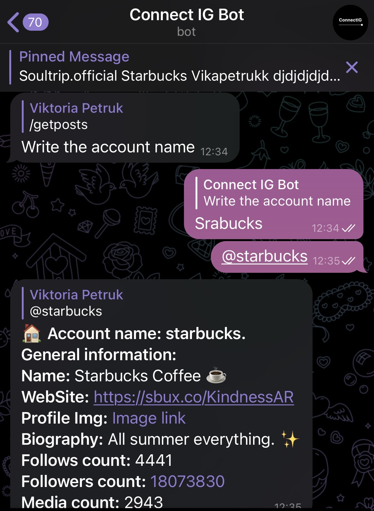

# IGBot-Telegram
IGBot - is telegram bot for receiving public posts from the Instagram. Using Facebook API + AWS Lambda. 
Using Business_Dicovery API to retrieve public posts.

<b>/start</b> - start app  
<b>/getinfo</b> - General account information 
<b>/getpost</b> - Recent account posts 
<b>/language</b> - Language settings (in development) 

How to setup AWS Lambda and Telegram Bot tutorial:
https://medium.com/aws-tip/building-serverless-c-telegram-bot-3df51b2f4661

How to setup Instagram API Business Discovery:
https://developers.facebook.com/docs/instagram-api/guides/business-discovery/

Recomedations to setup Instagram API for getting tokens:
- have a business Instagram account
- have a Facebook account
- have a page is created for this account
- Instagram account is linked to it in the settings
- developer account is created
- business (key) application is created in Meta for developers
- Graph Api extension is added
- token with specially selected permissions is generated :
instagram_basic, instagram_manage_insights, pages_show_list
- use Graph Api Explorer to find the ID of your Instagram, which you then need to use in token requests.
- you can generate 30 days long token after this.

Get public posts and menu: 

  Get general information: 
 

Please, reach me out if you have any questions.
