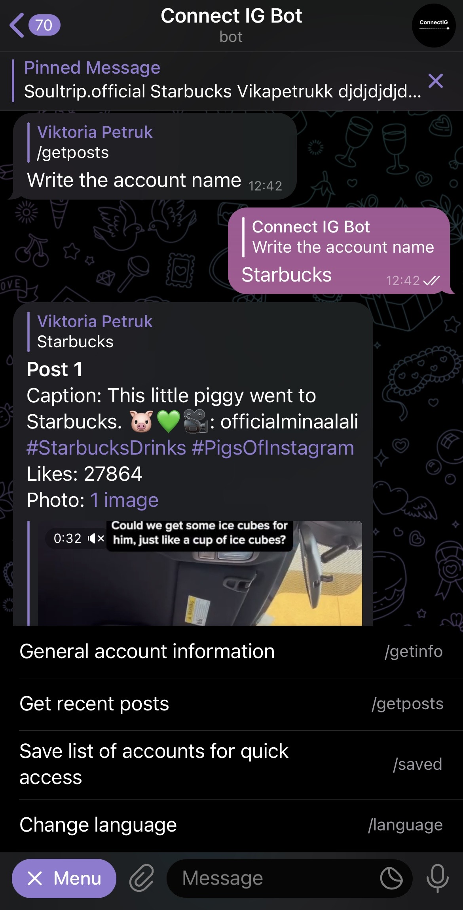

# IGBot-Telegram
Telegram bot for receiving public posts from the Instagram. Using Facebook API + AWS Lambda. 

IGBot - is Telegram bot for getting posts and information from accounts.

/start - start app
/getinfo - General account information
/getpost - Recent account posts
/language - Language settings (in development)

Get public posts and menu:

Get general information:

